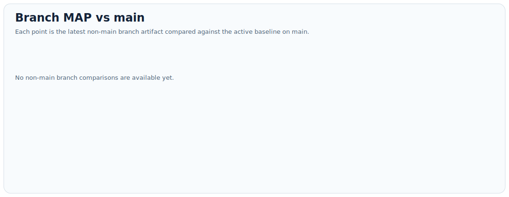
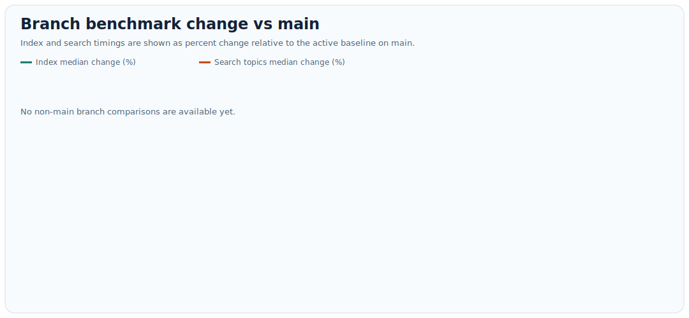

# Search Experiment Sandbox

This repository is a compact experimentation sandbox for a JASSjr-style search engine. The goal is to let an agent iteratively improve indexing and ranking strategy, evaluate the result with `trec_eval`, and keep changes only when they improve overall retrieval effectiveness without causing serious performance regressions.

## Inspiration And Provenance

This project is inspired by two upstream efforts:

- [karpathy/autoresearch](https://github.com/karpathy/autoresearch), which frames software improvement as an autonomous experiment loop driven by branch-based iteration and measurable outcomes. That repository is MIT-licensed.
- [andrewtrotman/JASSjr](https://github.com/andrewtrotman/JASSjr), which provides the minimal BM25 search engine foundation and the teaching-oriented WSJ/TREC setup that this repository adapts. JASSjr is BSD-2-Clause licensed and this repo keeps that upstream attribution in derived source files and includes the BSD-2-Clause text in [LICENSE.txt](LICENSE.txt).

The intent here is not to erase those upstream influences, but to combine them: autonomous experiment management from `autoresearch`, applied to search-engine tuning on top of a JASSjr-derived codebase.

## What This Repo Is For

- experimenting with indexing logic in `index/JASSjr_index.go`
- experimenting with ranking and query processing in `search/JASSjr_search.go`
- validating end-to-end behavior with a tiny smoke fixture
- evaluating real retrieval quality on the WSJ/TREC setup
- benchmarking indexing and search time so quality gains do not come with unacceptable slowdowns

This repo is intentionally small so an automated agent can understand the full workflow and iterate quickly.

## Core Workflow

Use these commands in order:

```bash
git checkout main
git pull --ff-only
./tests/smoke.sh
./tools/eval_wsj.sh /absolute/path/to/your/wsj.xml
./tools/benchmark_wsj.sh /absolute/path/to/your/wsj.xml
./tools/update_metrics_dashboard.sh
```

What they do:

- `./tests/smoke.sh`
  Runs a tiny fixture-based smoke evaluation to catch obvious breakage.
- `./tools/eval_wsj.sh`
  Builds the search engine, runs the TREC topics, and records a timestamped `trec_eval` summary.
- `./tools/benchmark_wsj.sh`
  Runs a few indexing and search benchmarks and records timestamped timings.
- `./tools/update_metrics_dashboard.sh`
  Exports the non-main branch comparisons and refreshes the graphs embedded in this README.
- `./tools/compare_branch_to_main.sh <branch>`
  Compares the latest evaluation and benchmark artifacts for a branch against the active baseline on `main`.
- `./tools/export_metrics_history.sh [branch]`
  Exports a TSV time series from saved artifacts so MAP and benchmark medians can be graphed over time.
- `./tools/export_branch_comparisons.sh`
  Exports the latest compatible artifact from every non-main branch as a branch-vs-main comparison TSV.

## Artifact Layout

Artifacts are grouped by the current git branch.

Evaluation summaries are written to:

- `experiment_evaluations/<branch>/`

Benchmark summaries are written to:

- `experiment_benchmarks/<branch>/`

This makes it easy to compare experiments branch by branch while keeping raw outputs out of git history. The `experiment_evaluations/original/` and `experiment_benchmarks/original/` folders are immutable initialization archives and must never be refreshed or overwritten.

Each new research loop should begin by refreshing the active baseline on `main`:

```bash
git checkout main
git pull --ff-only
./tests/smoke.sh
./tools/eval_wsj.sh /absolute/path/to/your/wsj.xml
./tools/benchmark_wsj.sh /absolute/path/to/your/wsj.xml
```

After that, create or update an experiment branch from the refreshed `main` baseline and require the branch to beat the newest `main` evaluation and benchmark artifacts before approving a PR.

To compare a branch against the current production baseline:

```bash
./tools/compare_branch_to_main.sh codex/search-my-idea
```

To export a graph-friendly TSV for the production branch:

```bash
./tools/export_metrics_history.sh > main-metrics.tsv
```

To refresh the committed dashboard assets:

```bash
./tools/update_metrics_dashboard.sh
```

The raw history export from `tools/export_metrics_history.sh` is designed for simple plotting of:

- retrieval effectiveness over time, especially `map`
- benchmark medians over time for indexing and search

That TSV also includes enough metadata to filter or separate runs:

- `collection`, `topics`, and `qrels` for evaluation rows
- `collection`, `topics`, `smoke_topics`, and `iterations` for benchmark rows

That matters because you may occasionally record toy or verification runs alongside full WSJ/TREC runs. For production graphs, filter to the real WSJ collection and the standard `51-100` topics/qrels before plotting `map`, `Rprec`, `P_10`, or the benchmark medians.

## Metrics Dashboard

The README graphs are generated assets. As part of a PR, refresh them after the latest evaluation and benchmark runs so the branch carries an updated comparison TSV and updated visual summary.

Generated files:

- `docs/metrics/branch-comparisons.tsv`
- `docs/graphs/map-vs-main.svg`
- `docs/graphs/benchmark-vs-main.svg`

The dashboard treats `main` as the active baseline and plots one point for each non-main branch with a compatible evaluation and benchmark artifact set. The `original` folders are excluded from this flow and remain read-only initialization references. If ten accepted experiment branches exist, the dashboard will show ten points.





## Success Criteria

A change is worth keeping only if:

- the smoke test still passes
- `trec_eval` improves overall retrieval effectiveness relative to the latest compatible evaluation on `main`
- indexing and search benchmarks do not show a serious regression relative to the latest compatible benchmark on `main`

In practice, `map` is the main headline metric, but `Rprec`, `P_10`, `bpref`, and `recip_rank` should also be watched.

## Repository Structure

- `index/`
  Index construction logic.
- `search/`
  Query evaluation and ranking logic.
- `tests/fixtures/`
  Tiny smoke-test collection and toy qrels/topics.
- `tools/smoke_eval.sh`
  Lightweight shell-based smoke evaluation.
- `tools/eval_wsj.sh`
  Full WSJ/TREC evaluation with timestamped reports.
- `tools/benchmark.sh`
  Generic timing helper used by benchmark scripts.
- `tools/benchmark_wsj.sh`
  Branch-aware indexing and search benchmark runner.
- `tools/update_metrics_dashboard.sh`
  Refreshes the committed TSV and README graph assets.
- `tools/compare_branch_to_main.sh`
  Branch-vs-main artifact comparison helper.
- `tools/compare_branch_to_master.sh`
  Compatibility wrapper that forwards to the main-based comparison helper.
- `tools/export_metrics_history.sh`
  TSV exporter for long-run metric history and graphing.
- `tools/export_branch_comparisons.sh`
  TSV exporter for the branch-vs-main dashboard.
- `tools/render_metrics_graphs.py`
  SVG graph renderer for the committed dashboard assets.
- `program.md`
  The agent operating plan for autonomous search experiments.
