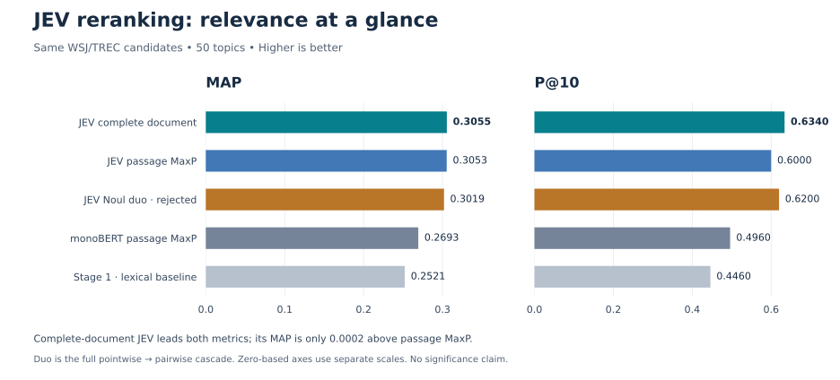

# JEV Reranking Comparisons

This repository compares **JEV-based reranking methods**: scoring individual
passages, scoring complete documents, and comparing documents against each other.
The aim is to measure which methods improve relevance, and how much additional
search time, model usage and cost each requires. monoBERT and duoBERT provide
reference approaches for those comparisons.

Experiments use the same WSJ/TREC collection, 50 topics and saved lexical
candidates. Stage 1 is fixed at **MAP 0.2521 before all reranking**; the research
focus is stage 2. Each experiment records its model, document coverage, scoring
rule, candidate depth, API calls, timing and cost alongside the raw `trec_eval`.

## Results

> [!IMPORTANT]
> **Full-document JEV has the highest measured MAP and P@10 in this comparison.**
> **MAP 0.3055** — up **21.2%** from the lexical baseline (0.2521).
> **P@10 0.6340** — up **42.2%** from the lexical baseline (0.4460), or
> **6.34 relevant results in the top 10 on average**, versus 4.46 before reranking.
>
> Passage MaxP is almost tied on MAP (0.3053) and leads reciprocal rank (0.8457).
> Adding the Noul duo pass reduces MAP to 0.3019 while increasing time and cost.

*Same WSJ/TREC candidates and 50 topics. Higher is better; each panel starts at
zero and uses its own scale. These measured differences are not significance
tests. Exact values and result links follow.
[Chart data](docs/metrics/jev-reranking-chart.json) · [Regenerate](tools/plot_jev_results.py).*

| Method | MAP | P@10 | recip_rank | Status |
| --- | ---: | ---: | ---: | --- |
| [JEV pointwise: complete document](reranking/results/jev-full-documents-top100-20260918/results.md) | **0.3055** | **0.6340** | 0.8063 | Evaluated; best MAP and P@10 in this comparison |
| [JEV pointwise: passage MaxP](reranking/results/jev-passages-maxp-top100-20260918-retry/results.md) | 0.3053 | 0.6000 | **0.8457** | Evaluated; best reciprocal rank in this comparison |
| [JEV pointwise → Noul duo, top 20](https://github.com/carlaiau/jev-reranking/blob/633c11b/reranking/results/jev-duo-noul-top20-20260918/summary.md) | 0.3019 | 0.6200 | 0.8072 | Rejected; lowers MAP versus its pointwise input |
| [monoBERT passage MaxP](reranking/results/monobert-maxp-top100-20260918/results.md) | 0.2693 | 0.4960 | 0.6715 | Evaluated reference; local Apple GPU |
| [Stage 1: BM25 + query expansion](stage1/results/integrated-main-20260918/results.md) | 0.2521 | 0.4460 | 0.6271 | Fixed baseline; all reranking disabled |

**MAP** measures average ranking quality across queries. **P@10** is the fraction
of the first ten results that are relevant (`P_10` in `trec_eval`).
**recip_rank** averages the reciprocal position of the first relevant result.
Higher is better for all three metrics; full reports also include Rprec and bpref.

Pointwise JEV scores the top 100 candidates using Noul. The passage method uses
the identical windows supplied to monoBERT and takes the highest passage score
for each document (MaxP). The complete-document method scores the entire parsed
article once. Both use JEV 1.13.0 and eight concurrent calls per query; see the
[implementation and run commands](reranking/jev-comparison.md).

The Noul duo experiment takes the top 20 from the complete-document pointwise
ranking and compares every ordered pair using complete articles. Each document's
score is the sum of its 19 outgoing probabilities, following duoBERT's Sum idea.
Its negative result and implementation remain on a separate experiment branch;
the link above points to that preserved evidence. Model-backed duoBERT and
multi-document JEV Choice comparisons are not yet measured in this table.

## Time, calls and cost

| Method | Successful scoring calls | Added reranking time, all 50 topics | Query median | Estimated API cost |
| --- | ---: | ---: | ---: | ---: |
| JEV complete document | 5,000 | 211.49 s | 4.02 s | $0.328312 |
| JEV passage MaxP | 19,593 | 767.73 s | 14.98 s | $0.605227 |
| JEV Noul duo pass alone | 19,000 | 837.98 s | 15.05 s | $2.305419 |
| monoBERT passage MaxP | 2,475 batches / 19,593 passages | 1,510.93 s | 30.27 s | $0 hosted API; local compute unknown |

The duo pass incurred **19,010 API attempts**, including ten recovered failures.
Its full pointwise→duo cascade totals **1,049.48 s of reranking** and an estimated
**$2.633731** in API cost, adding the saved pointwise measurement. It lowers MAP
while increasing time and cost, so this configuration was rejected.

These are single uncached runs, not repeated benchmark medians. Query medians
exclude shared setup. Composed search time adds the saved lexical search pass;
it is not a fresh integrated benchmark. Local compute cost is unknown for all
methods, and any failed-request charges are unknown. The
[paired JEV report](reranking/results/jev-comparison-20260918.md) separately
records the failed first passage run and its known usage. Reported settings are
exploratory on these topics, not held-out validation.

## Repository workflow

**Stage 1 — freeze candidate retrieval.** The JASSjr-derived engine uses BM25
with pseudo-relevance feedback. Its saved baseline excludes dense retrieval,
neural/API reranking and query-rewrite sidecars. Five-run medians are **11.03 s
indexing** and **0.41 s search for all 50 topics**. The baseline includes the
candidate run, topics, qrels, configuration and hashes under
[`stage1/results/`](stage1/results/integrated-main-20260918/results.md).
See the [stage-1 implementation](stage1/README.md).

**Stage 2 — compare rerankers.** Reuse those candidates and the existing index.
Declare the input text, candidate depth and document scoring rule for each
experiment; preserve untouched ranking tails. Save separate Markdown reports,
raw evaluations and usage evidence under [`reranking/results/`](reranking/results/README.md).
See the [reranking methodology](reranking/README.md) and [research program](program.md).

`main` is the code integration branch. New code or verification runs do not
automatically replace the frozen baseline. The original initialization archive
remains read-only historical data.

## Inspiration And Provenance

This project is inspired by two upstream efforts:

- [karpathy/autoresearch](https://github.com/karpathy/autoresearch), which frames software improvement as an autonomous experiment loop driven by branch-based iteration and measurable outcomes. That repository is MIT-licensed.
- [andrewtrotman/JASSjr](https://github.com/andrewtrotman/JASSjr), which provides the minimal BM25 search engine foundation and the teaching-oriented WSJ/TREC setup that this repository adapts. JASSjr is BSD-2-Clause licensed and this repo keeps that upstream attribution in derived source files and includes the BSD-2-Clause text in [THIRD_PARTY_NOTICES.txt](THIRD_PARTY_NOTICES.txt).

The project applies that experiment-and-evaluate workflow to comparing JEV reranking methods, preserving both positive and negative results.

This project is licensed under the MIT License, except for JassJr related code which is included in this repository, which are licensed under their respective open-source licenses, please see THIRD_PARTY_NOTICES.txt for details.
